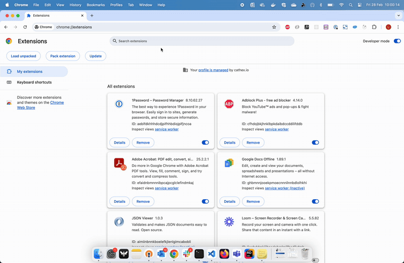
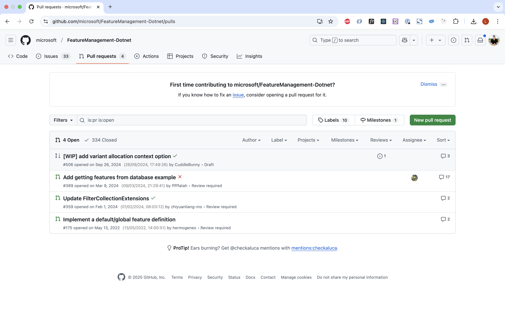
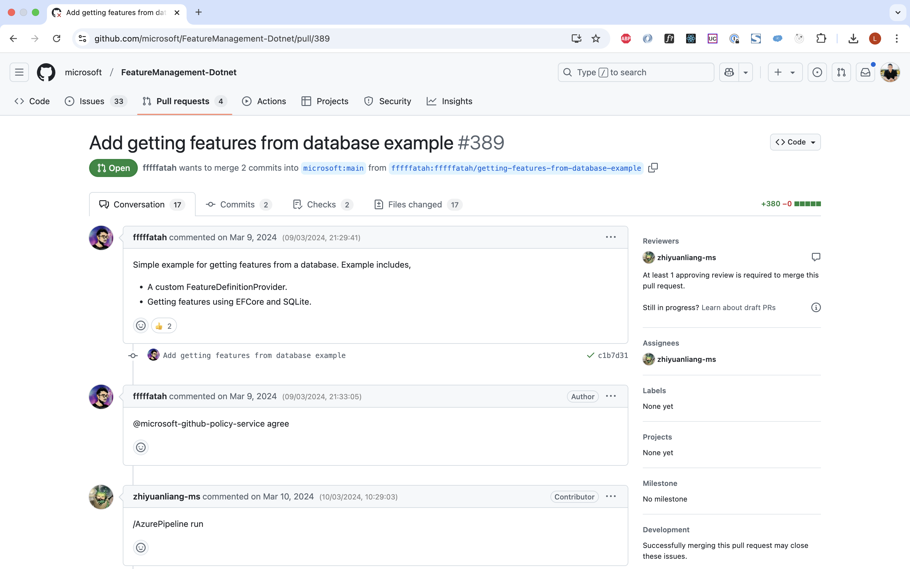

# Github Datetime GPT

## Overview

This project is a Chrome extension built using Plasmo. It shows absolute dates in GitHub to enhance your browsing experience.

## Demo





## Installation & Use

To install and set up the project, follow the steps below:

1. **Clone the repository:**

    ```sh
    git clone <repository-url>
    cd <repository-directory>
    ```

2. **Install dependencies:**

    ```sh
    pnpm install
    ```

3. **Build the project:**

    ```sh
    pnpm build
    ```

4. **Load the extension in Chrome:**

    - Open Chrome and navigate to `chrome://extensions/`.
    - Enable "Developer mode" by toggling the switch in the top right corner.
    - Click on "Load unpacked" and select the [`build/chrome-mv3-prod`](build/chrome-mv3-prod ) directory.

5. **Navigate to your PR to see it in action**

## Contributing

We welcome contributions!